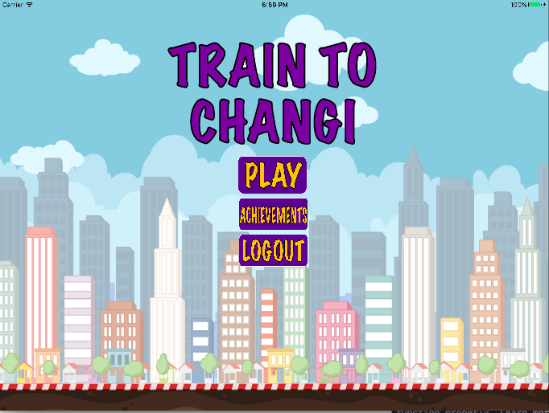
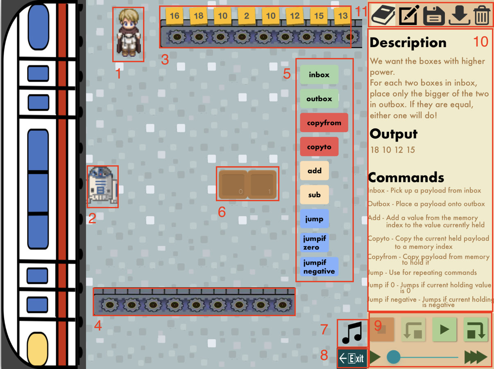
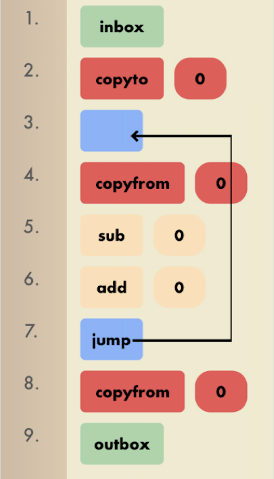
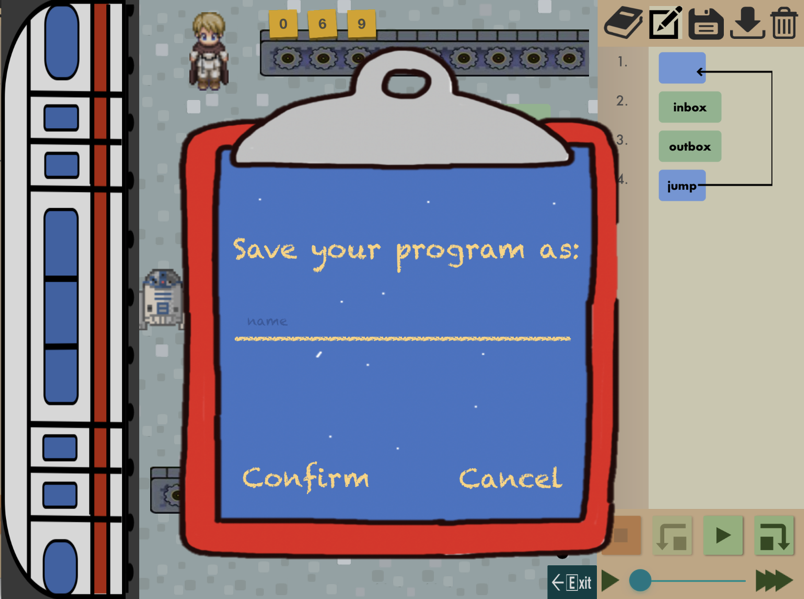
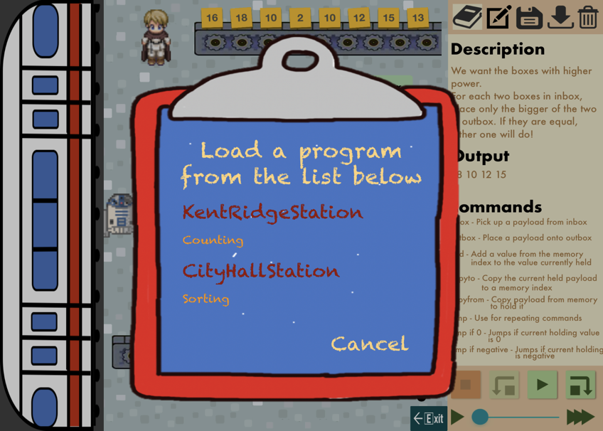
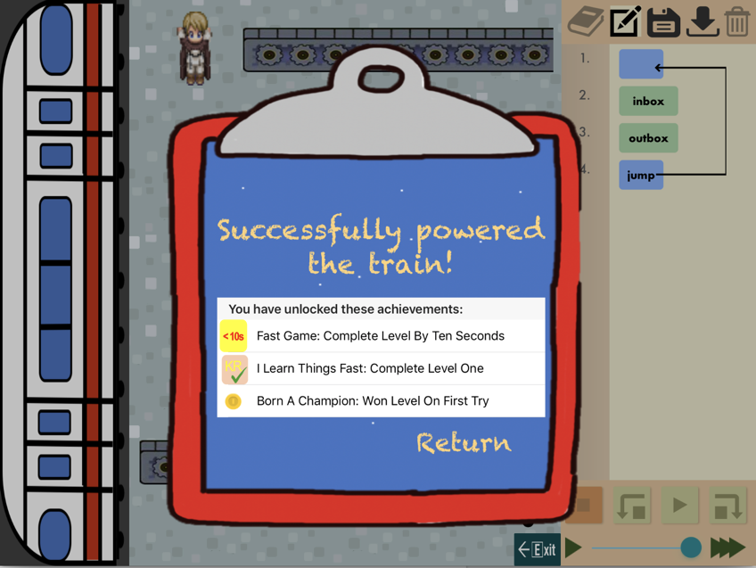

 
_Figure 1. Main Screen_ 

---

## Overview
Train to Changi is the next generation programming-based puzzle game that is interactive and exciting. It aims to help users master cognitive reasoning skills such as algorithmic thinking, pattern recognition and problem analysis.
 
Today, there is recognition of the benefits of knowing how to program, and increased demand and attractiveness of a computing degree in terms of job opportunities and personal/entrepreneurial goals. Train to Changi as a gaming application, aspires to spread the understanding of what programming is about in a fun, engaging way that will inspire the interest in its users.
 
In Train to Changi, the user take on a role as a train passenger who wants to reach his destination of Changi. Unfortunately, the train refuses to travel smoothly and breaks down at every station due to different system failures. In order to power up the train and repair the faulty systems, the player has to solve different pre-designed puzzles of increasing difficulty.
 
Luckily for the passenger he is travelling with his new trusty robot that he can program to do things via a visual programming language. The purpose of using a visual programming language is to distil the complexities of programming into an easily understood visual metaphor. Given the inputs and the required outputs, the player must combine a list of instructions from the given set of rudimentary commands to develop a workable program. Such commands include:

* Picking up an input
* Performing addition or subtraction
* Jumps
* Storing a value into memory
* Placing a value into output

## Firing up the application

When you first fire up the application, you will be presented with the login screen. At this screen, you are given a choice to either create a game profile by signing in with your Google account or to try the game as a guest player.

## Gameplay

When you first enter a station, you will be presented with the Gameplay Screen. The names of the interactive elements in the screen is listed below:

  
_Figure 2. Gameplay Screen_ &nbsp;&nbsp;&nbsp;&nbsp;&nbsp;&nbsp;&nbsp;&nbsp;&nbsp;&nbsp;&nbsp;&nbsp;&nbsp;&nbsp;&nbsp;&nbsp;&nbsp;&nbsp;&nbsp;&nbsp;&nbsp;&nbsp;&nbsp;&nbsp;&nbsp;&nbsp;&nbsp;&nbsp;&nbsp;&nbsp;&nbsp;&nbsp;&nbsp;&nbsp;&nbsp;&nbsp;&nbsp;&nbsp;&nbsp;&nbsp;&nbsp;&nbsp;&nbsp;&nbsp;&nbsp;&nbsp;&nbsp;&nbsp;&nbsp;&nbsp;&nbsp;&nbsp;&nbsp;&nbsp;&nbsp;&nbsp;&nbsp;&nbsp;&nbsp;&nbsp;&nbsp;&nbsp;&nbsp;&nbsp;&nbsp; _Figure 3. Editor Panel_

#### 1\. Passenger
When you tap on the passenger sprite, you will be presented with a speech bubble that will detail the thoughts of the passenger. You can tap the passenger again to deactivate the speech bubble. The passenger will also present the speech bubble when your program did not produce the expected output or if you create an invalid program.
 
#### 2\. Robot
The robot will be the entity that responds to the commands that you program. He will be responsible for carrying the payload to different locations and performing the arithmetic operations.
 
#### 3\. Input Conveyor Belt
The Input Conveyor Belt will be randomly populated the inputs for the current level. This is the location which the robot will travel to when he reads an ‘Inbox’ command.
 
#### 4\. Output Conveyor Belt
The Output Conveyor is the location which the robot will travel to when he reads an ‘Outbox’ command to place the payload that he is carrying.
 
#### 5\. List of available commands for this station from the visual programming language
This is a subset of the necessary commands from the visual programming language needed for the player to solve the current level. Tap on the commands to add them into the editor.
If you are on the description view, the editor will be presented to you automatically.

#### 6\. Memory Locations
This are the locations that are available for the robot to place a payload temporarily or retrieve them if needed. This is the location which the robot will travel to when he reads an ‘copyTo’, ‘copyFrom’, ‘add’, ‘sub’ command.
 
#### 7\. Background music toggle button
Press on this button to toggle the background music
 
#### 8\. Exit button
Press on this button to return to the Levels Selection Screen.
 
#### 9\. Control Panel
The control panel has 4 buttons:
1. Stop button: Press this button to stop and reset the execution.
1. Step back button: Press this button to step back the execution of the latest command
1. Play/Pause button: Press this button to start or pause the execution
1. Step forward button: Press this button to step back the execution of the latest command

The control panel also has a speed slider which allows you to control the speed of the animation of the game.
 
#### 10\. Description and Editor Panels
The Description Panel have the following elements:
1. Description: Provides the puzzle description for the current level
1. Output: Provides the expected output to the user
1. Commands Instruction: Gives a brief description for the function of each command.
 
The Editor Panel list all the commands that you have included. You can drag and drop the commands to reorganize their execution sequence or swipe them to the right to remove them. For commands that deals with memory locations, tap on them to initiate the change process then then tap on the memory location you wish to change to. If you wish to cancel the process, just tap on them again.
 
#### 11\. Tabs Panel
The Tabs Panel has the following elements:
1. Description Panel Tab: Tap on this to display the Description Panel
1. Editor Panel Tab: Tap on this to display the Editor Panel
1. Save Program Button: Tap on this to display the Save Program Screen
1. Load Program Button: Tap on this to display the Load Program Screen
1. Reset Program Button: Tap on this to remove all commands in the Editor Panel
 
## Execution States

You may use the Control Panel buttons to execute the program you created to produce the expected output. When you press the play button, the execution of the program will be continuous, and you can pause it by pressing the pause button or stop it by pressing the stop button. However, if you do not wish to execute your program in its whole, you can step forward and backwards through the commands by pressing on the step forward and step backwards button respectively to see the result of the execution of the latest command.
 
On the other hand, do note that if you wish to edit the commands in the editor, the execution state will be reset to the beginning.
 
## Saving and Loading Programs

If you ever find yourself having written a useful program and wish to save it, you can do so by tapping on the Save Program Button in the Tabs Panel. This will activate the Save Program Screen where you can enter the name of the program you want to save. Do note that empty names are not allowed, and if you save to a previously used name, the game will override the previously saved program
 	 
  
_Figure 4. Save Program Screen_ &nbsp;&nbsp;&nbsp;&nbsp;&nbsp;&nbsp;&nbsp;&nbsp;&nbsp;&nbsp;&nbsp;&nbsp;&nbsp;&nbsp;&nbsp;&nbsp;&nbsp;&nbsp;&nbsp;&nbsp;&nbsp;&nbsp;&nbsp;&nbsp;&nbsp;&nbsp;&nbsp;&nbsp;&nbsp;&nbsp;&nbsp;&nbsp;&nbsp;&nbsp;&nbsp;&nbsp; _Figure 5. Load Program Screen_  
 
If you want to load a program that you previously save – be it this current station or in other levels- you can tap on the Load Program Button and activate the Load Program Screen where you can load the program you wish to.
 
## Clearing a Level

To clear a level, you have to design the correct algorithm and implement it using the commands from the visual programming language in the game. Upon producing all the expected output in the correct sequence, and you will be presented with an end game screen where your achievements for the current level will also be displayed.

 
_Figure 6. End Game Screen_  